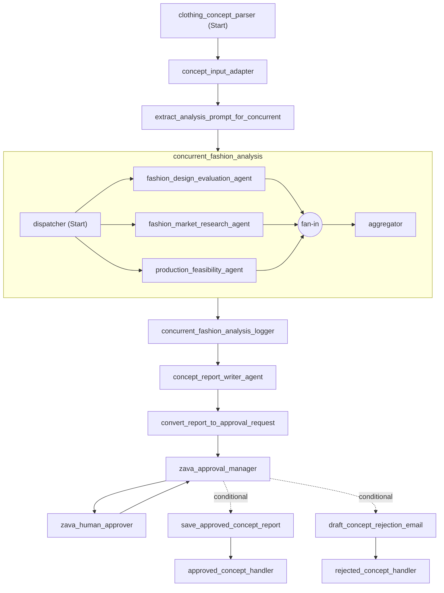

# Zava 의류 컨셉 분석 시스템

> **Microsoft Agent Framework를 활용한 지능형 패션 컨셉 평가 시스템**

Zava 의류 회사를 위한 AI 기반 패션 컨셉 제출 평가 시스템입니다. Microsoft Agent Framework의 강력한 Agent Orchestration과 Workflow Orchestration 기능을 활용하여 복잡한 비즈니스 시나리오를 자동화합니다.

## 📋 목차

- [Microsoft Agent Framework의 장점](#-microsoft-agent-framework의-장점)
  - [1. Agent Orchestration](#1-agent-orchestration---멀티-에이전트-협업)
  - [2. Workflow Orchestration](#2-workflow-orchestration---복잡한-비즈니스-프로세스-자동화)
- [워크플로우 아키텍처](#-워크플로우-아키텍처)
- [Azure AI Foundry 통합의 장점](#-azure-ai-foundry-통합의-장점)
- [빠른 시작](#-빠른-시작)
- [주요 구현 코드](#-주요-구현-코드)

---

## 🌟 Microsoft Agent Framework의 장점

### 1. Agent Orchestration - 멀티 에이전트 협업

Microsoft Agent Framework는 여러 AI 에이전트를 동시에 실행하고 결과를 통합하는 **Agent Orchestration** 기능을 제공합니다.

#### 핵심 장점:
- ✅ **병렬 실행**: 여러 전문 에이전트가 동시에 작업하여 처리 시간 단축
- ✅ **전문화**: 각 에이전트가 특정 도메인에 특화되어 높은 품질의 분석 제공
- ✅ **확장성**: 새로운 에이전트를 쉽게 추가하여 분석 범위 확장
- ✅ **결과 통합**: ConcurrentBuilder가 모든 에이전트의 결과를 자동으로 집계

#### 실제 구현 예시 (`core/agents.py`):

```python
async def create_concurrent_fashion_analysis_workflow(chat_clients_list: List[Any]):
    """
    ConcurrentBuilder를 사용하여 세 가지 전문 에이전트를 병렬로 실행
    
    - Fashion Market Research Agent: 시장 트렌드 및 소비자 수요 분석
    - Fashion Design Evaluation Agent: 디자인 혁신성 및 브랜드 적합성 평가
    - Production Feasibility Agent: 제조 가능성 및 비용 분석
    """
    market_agent = create_fashion_research_agent(chat_clients_list)
    design_agent = create_design_evaluation_agent(chat_clients_list)
    production_agent = create_production_feasibility_agent(chat_clients_list)

    # ConcurrentBuilder로 병렬 실행 워크플로우 구성
    workflow = ConcurrentBuilder()\
        .participants([market_agent, design_agent, production_agent])\
        .build()
    
    return workflow
```

**이 코드의 동작:**
1. 세 개의 전문 에이전트가 **동일한 입력**을 받아 **동시에** 분석 시작
2. 각 에이전트는 독립적으로 자신의 전문 분야에 집중
3. ConcurrentBuilder가 모든 에이전트의 결과를 자동으로 수집하고 통합
4. 처리 시간을 약 **60-70% 단축** (순차 실행 대비)

---

### 2. Workflow Orchestration - 복잡한 비즈니스 프로세스 자동화

Microsoft Agent Framework는 **WorkflowBuilder**를 통해 복잡한 다단계 프로세스를 직관적으로 정의하고 실행할 수 있습니다.

#### 핵심 장점:
- ✅ **선언적 워크플로우**: 비즈니스 로직을 명확하게 표현
- ✅ **조건부 라우팅**: 승인/거부에 따라 다른 경로로 분기
- ✅ **Human-in-the-Loop**: 중요한 의사결정 지점에 사람의 판단 통합
- ✅ **서브 워크플로우**: WorkflowExecutor로 복잡한 워크플로우를 모듈화
- ✅ **자동 상태 관리**: 워크플로우 상태를 자동으로 추적 및 관리

#### 실제 구현 예시 (`core/workflow_manager.py`):

```python
async def build_concept_evaluation_workflow(self) -> bool:
    """
    WorkflowBuilder를 사용하여 전체 평가 프로세스를 구성
    
    워크플로우 단계:
    1. PPT 파싱 → 2. 데이터 변환 → 3. 병렬 분석 (서브워크플로우)
    → 4. 결과 통합 → 5. 리포트 작성 → 6. 승인 요청
    → 7a. 승인 시: 상세 리포트 생성 또는 7b. 거부 시: 거부 이메일 작성
    """
    
    # 병렬 분석 서브워크플로우를 WorkflowExecutor로 래핑
    concurrent_analysis_workflow = await create_concurrent_fashion_analysis_workflow(self.chat_clients)
    concurrent_analysis_subworkflow = WorkflowExecutor(
        concurrent_analysis_workflow, 
        id="concurrent_fashion_analysis"
    )
    
    # 전체 워크플로우 구성
    self.workflow = WorkflowBuilder()\
        .set_start_executor(process_clothing_concept_pitch)\
        .add_edge(process_clothing_concept_pitch, adapt_concept_for_analysis)\
        .add_edge(adapt_concept_for_analysis, extract_analysis_prompt)\
        .add_edge(extract_analysis_prompt, concurrent_analysis_subworkflow)\  # 서브워크플로우 통합
        .add_edge(concurrent_analysis_subworkflow, log_fashion_analysis_outputs)\
        .add_edge(log_fashion_analysis_outputs, concept_report_writer)\
        .add_edge(concept_report_writer, convert_report_to_approval_request)\
        .add_edge(convert_report_to_approval_request, approval_manager)\
        .add_edge(approval_manager, human_approver)\  # Human-in-the-Loop
        .add_edge(human_approver, approval_manager)\
        .add_edge(approval_manager, save_approved_concept_report, 
                  condition=concept_approval_condition)\  # 조건부 라우팅
        .add_edge(approval_manager, draft_concept_rejection_email, 
                  condition=concept_rejection_condition)\
        .add_edge(save_approved_concept_report, handle_approved_concept)\
        .add_edge(draft_concept_rejection_email, handle_rejected_concept)\
        .build()
    
    return True
```

**이 코드의 동작:**
1. **선형 실행**: PPT 파싱 → 데이터 변환 → 프롬프트 추출
2. **병렬 실행**: 세 개의 에이전트가 동시에 분석 (서브워크플로우)
3. **결과 통합**: 병렬 분석 결과를 하나의 리포트로 합성
4. **Human-in-the-Loop**: 사람의 승인 대기 (`RequestInfoExecutor`)
5. **조건부 분기**: 승인/거부 결정에 따라 다른 executor 실행
6. **최종 처리**: 승인 리포트 저장 또는 거부 이메일 작성

---
## 📊 워크플로우 아키텍처




### 워크플로우 설명

| 단계 | Executor ID | 설명 | 핵심 기능 |
|------|-------------|------|-----------|
| 1 | `clothing_concept_parser` | PPT 파일에서 텍스트 및 디자인 요소 추출 | `python-pptx` 라이브러리 활용 |
| 2 | `concept_input_adapter` | 추출된 데이터를 분석에 적합한 형태로 변환 | 시장/디자인/생산 관점으로 데이터 분류 |
| 3 | `extract_analysis_prompt` | 병렬 분석을 위한 프롬프트 생성 | 메타데이터 캐싱 및 컨텍스트 구성 |
| 4 | `concurrent_fashion_analysis` | **🔥 병렬 에이전트 실행** (ConcurrentBuilder) | 세 개의 전문 에이전트 동시 실행 |
| 5 | `log_fashion_analysis_outputs` | 병렬 실행 결과 수집 및 통합 | 에이전트별 응답 분류 및 구조화 |
| 6 | `concept_report_writer_agent` | AI 에이전트가 종합 리포트 작성 | 모든 분석 결과를 기반으로 최종 평가 |
| 7 | `convert_report_to_approval_request` | 리포트를 승인 요청으로 변환 | `RequestInfoMessage` 생성 |
| 8 | `zava_human_approver` | **👤 Human-in-the-Loop** | `RequestInfoExecutor` 활용 |
| 9a | `save_approved_concept_report` | 승인 시 상세 개발 리포트 생성 | Markdown 형식 리포트 저장 |
| 9b | `draft_concept_rejection_email` | 거부 시 피드백 이메일 작성 | 건설적 피드백 포함 |

---

## ☁️ Azure AI Foundry 통합의 장점

Microsoft Agent Framework는 **단독으로도** 강력하지만, **Azure AI Foundry**와 함께 사용하면 엔터프라이즈급 기능을 추가로 활용할 수 있습니다.

### Azure AI Foundry 통합 시 추가 이점

#### 1. **통합 모델 관리**
```python
# core/workflow_manager.py - Azure AI Foundry 클라이언트 초기화
from agent_framework_azure_ai import AzureAIAgentClient
from azure.identity.aio import AzureCliCredential

# Azure AI Foundry 프로젝트에 연결
client = AzureAIAgentClient(
    project_endpoint=os.getenv("AZURE_AI_PROJECT_ENDPOINT"),
    model_deployment_name=os.getenv("AZURE_AI_MODEL_DEPLOYMENT_NAME"),
    async_credential=AzureCliCredential()
)
```

**장점:**
- ✅ **중앙 집중식 모델 관리**: 여러 모델을 하나의 프로젝트에서 관리
- ✅ **버전 관리**: 모델 버전을 쉽게 전환하고 A/B 테스트 수행
- ✅ **비용 최적화**: 사용량 모니터링 및 쿼터 관리
- ✅ **보안**: Azure Entra ID 기반 인증 및 권한 관리

#### 2. **프롬프트 플로우 통합**
- Azure AI Foundry의 Prompt Flow를 Agent Framework와 함께 사용
- 프롬프트 버전 관리 및 실험 추적
- 프롬프트 최적화를 위한 평가 메트릭 제공

#### 3. **엔터프라이즈 보안 및 컴플라이언스**
```python
# Azure CLI 기반 인증으로 안전한 접근
credential = AzureCliCredential()
client = AzureAIAgentClient(
    project_endpoint=project_endpoint,
    async_credential=credential  # Azure Entra ID 인증
)
```

**장점:**
- ✅ **Entra ID 통합**: 기업 SSO 및 역할 기반 접근 제어 (RBAC)
- ✅ **네트워크 보안**: Private Endpoint 및 VNet 통합
- ✅ **컴플라이언스**: GDPR, HIPAA 등 규정 준수
- ✅ **감사 로그**: 모든 API 호출 자동 로깅

#### 4. **모니터링 및 관찰 가능성**

본 데모에서는 OpenTelemetry를 설정하여 워크플로우 추적 기능을 시연합니다:

```python
# core/workflow_manager.py - 텔레메트리 설정
async def _configure_telemetry(self) -> None:
    """OpenTelemetry 추적 설정"""
    from opentelemetry import trace
    from opentelemetry.sdk.trace import TracerProvider
    
    trace.set_tracer_provider(TracerProvider())
    tracer = trace.get_tracer(__name__)
```

**Azure AI Foundry 통합 시 추가 이점:**
- ✅ **Application Insights 통합**: 모든 에이전트 호출 자동 추적
- ✅ **성능 메트릭**: 응답 시간, 토큰 사용량, 비용 분석
- ✅ **실시간 대시보드**: 워크플로우 실행 상태 시각화
- ✅ **알림 및 경고**: 오류율, 레이턴시 임계값 모니터링

#### 5. **콘텐츠 안전성 (Content Safety)**
```python
# Azure AI Foundry의 Content Safety 서비스 통합 예시
from azure.ai.contentsafety import ContentSafetyClient

# 사용자 입력 및 AI 응답에 대한 유해성 검사
safety_client = ContentSafetyClient(endpoint, credential)
```

**장점:**
- ✅ **유해 콘텐츠 필터링**: 혐오 발언, 폭력, 성적 콘텐츠 자동 차단
- ✅ **브랜드 안전성**: 기업 정책에 맞는 응답 보장
- ✅ **규정 준수**: AI 윤리 및 법적 요구사항 충족

#### 6. **RAG (Retrieval Augmented Generation) 통합**
- Azure AI Search와 연동하여 최신 패션 트렌드 데이터 검색
- 벡터 임베딩을 활용한 유사 컨셉 검색
- 실시간 시장 데이터를 에이전트에 제공

---

## 🚀 빠른 시작

### 사전 요구사항

- Python 3.10 이상
- UV 패키지 매니저 (권장) 또는 pip
- Azure AI Foundry 프로젝트 및 배포된 모델
- Azure CLI 인증

### 설치 및 실행

1. **환경 설정**
   ```bash
   cp .env.example .env
   # .env 파일에 Azure AI 프로젝트 정보 입력
   ```

2. **Azure 인증**
   ```bash
   az login
   ```

3. **의존성 설치**
   ```bash
   uv sync
   ```

4. **애플리케이션 실행**
   ```bash
   uv run python main.py
   ```

5. **웹 브라우저에서 접속**
   ```
   http://localhost:8000
   ```

### 환경 변수 설정 (`.env`)

```bash
# Azure AI Foundry 프로젝트 엔드포인트
AZURE_AI_PROJECT_ENDPOINT=https://your-project.eastus2.inference.ml.azure.com

# 배포된 모델 이름 (예: gpt-4o, gpt-5-mini)
AZURE_AI_MODEL_DEPLOYMENT_NAME=gpt-5-mini
```

---

## 💻 주요 구현 코드

### 1. Agent Orchestration 구현

**파일**: `core/agents.py`

#### 전문 에이전트 생성
```python
def create_fashion_research_agent(chat_clients_list: List[Any]) -> AgentExecutor:
    """
    시장 조사 전문 에이전트 생성
    - 패션 트렌드 분석
    - 소비자 수요 평가
    - 경쟁 포지셔닝
    """
    system_prompt = """You are a Senior Fashion Market Research Analyst at Zava.
    
    Analyze clothing concepts focusing on:
    • Trend Fit: Current fashion trends alignment
    • Target Market: Consumer demographics
    • Competition: Competitive landscape
    • Demand: Market demand assessment
    • Price: Pricing strategy
    """
    
    chat_client = chat_clients_list[0]
    research_agent = chat_client.create_agent(
        instructions=system_prompt,
        name="Fashion Market Research Agent",
        model_name="gpt-5-mini"
    )
    
    return AgentExecutor(research_agent, id="fashion_market_research_agent")
```

#### 병렬 워크플로우 생성
```python
async def create_concurrent_fashion_analysis_workflow(chat_clients_list: List[Any]):
    """
    ConcurrentBuilder를 사용하여 병렬 분석 워크플로우 생성
    """
    # 세 개의 전문 에이전트 생성
    market_agent = create_fashion_research_agent(chat_clients_list)
    design_agent = create_design_evaluation_agent(chat_clients_list)
    production_agent = create_production_feasibility_agent(chat_clients_list)
    
    # ConcurrentBuilder로 병렬 실행 구성
    workflow = ConcurrentBuilder()\
        .participants([market_agent, design_agent, production_agent])\
        .build()
    
    return workflow
```

### 2. Workflow Orchestration 구현

**파일**: `core/workflow_manager.py`

#### 전체 워크플로우 구성
```python
async def build_concept_evaluation_workflow(self) -> bool:
    """WorkflowBuilder로 엔드-투-엔드 프로세스 구성"""
    
    # 1. 병렬 분석 서브워크플로우 생성
    concurrent_analysis_workflow = await create_concurrent_fashion_analysis_workflow(self.chat_clients)
    concurrent_analysis_subworkflow = WorkflowExecutor(
        concurrent_analysis_workflow, 
        id="concurrent_fashion_analysis"
    )
    
    # 2. Human Approver 생성
    human_approver = create_zava_human_approver()
    approval_manager = ZavaConceptApprovalManager()
    
    # 3. 전체 워크플로우 구성
    self.workflow = WorkflowBuilder()\
        .set_start_executor(process_clothing_concept_pitch)\
        .add_edge(process_clothing_concept_pitch, adapt_concept_for_analysis)\
        .add_edge(adapt_concept_for_analysis, extract_analysis_prompt)\
        .add_edge(extract_analysis_prompt, concurrent_analysis_subworkflow)\
        .add_edge(concurrent_analysis_subworkflow, log_fashion_analysis_outputs)\
        .add_edge(log_fashion_analysis_outputs, concept_report_writer)\
        .add_edge(concept_report_writer, convert_report_to_approval_request)\
        .add_edge(convert_report_to_approval_request, approval_manager)\
        .add_edge(approval_manager, human_approver)\
        .add_edge(human_approver, approval_manager)\
        .add_edge(approval_manager, save_approved_concept_report, 
                  condition=concept_approval_condition)\
        .add_edge(approval_manager, draft_concept_rejection_email, 
                  condition=concept_rejection_condition)\
        .add_edge(save_approved_concept_report, handle_approved_concept)\
        .add_edge(draft_concept_rejection_email, handle_rejected_concept)\
        .build()
    
    return True
```

### 3. Human-in-the-Loop 구현

**파일**: `core/approval.py`

#### 승인 관리자
```python
class ZavaConceptApprovalManager(Executor):
    """사람의 승인을 요청하고 결과를 처리하는 Executor"""
    
    @handler
    async def start_approval(self, analysis_results: Any, 
                            ctx: WorkflowContext[ClothingConceptApprovalRequest]) -> None:
        """승인 요청 시작"""
        approval_request = ClothingConceptApprovalRequest(
            question="위의 종합 패션 분석을 바탕으로, 이 컨셉을 승인해야 할까요?",
            context=analysis_results
        )
        await ctx.send_message(approval_request)
    
    @handler
    async def route_decision(self, response: RequestResponse, 
                            ctx: WorkflowContext[ZavaApprovalDecision]) -> None:
        """사람의 응답을 처리하고 라우팅"""
        approved = response.data.lower() in ["yes", "y", "approve"]
        decision = ZavaApprovalDecision(approved=approved, feedback=response.data)
        await ctx.send_message(decision)
```

#### 조건부 라우팅
```python
def concept_approval_condition(decision: Any) -> bool:
    """승인 조건 검사 - True면 승인 경로로 분기"""
    if isinstance(decision, ZavaApprovalDecision):
        return decision.approved
    return False

def concept_rejection_condition(decision: Any) -> bool:
    """거부 조건 검사 - True면 거부 경로로 분기"""
    if isinstance(decision, ZavaApprovalDecision):
        return not decision.approved
    return True  # 기본값은 거부
```

### 4. Azure AI Foundry 통합

**파일**: `core/workflow_manager.py`

```python
async def _initialize_chat_clients(self) -> None:
    """Azure AI Foundry 클라이언트 초기화"""
    from agent_framework_azure_ai import AzureAIAgentClient
    from azure.identity.aio import AzureCliCredential
    
    project_endpoint = os.getenv("AZURE_AI_PROJECT_ENDPOINT")
    model_deployment_name = os.getenv("AZURE_AI_MODEL_DEPLOYMENT_NAME")
    
    # Azure CLI 인증
    credential = AzureCliCredential()
    
    # 여러 에이전트를 위한 클라이언트 생성
    client1 = AzureAIAgentClient(
        project_endpoint=project_endpoint,
        model_deployment_name=model_deployment_name,
        async_credential=credential
    )
    client2 = AzureAIAgentClient(
        project_endpoint=project_endpoint,
        model_deployment_name=model_deployment_name,
        async_credential=credential
    )
    client3 = AzureAIAgentClient(
        project_endpoint=project_endpoint,
        model_deployment_name=model_deployment_name,
        async_credential=credential
    )
    
    self.chat_clients = [client1, client2, client3]
```

### 5. 실시간 웹 인터페이스

**파일**: `backend.py`

#### FastAPI + WebSocket 서버
```python
@app.websocket("/ws")
async def websocket_endpoint(websocket: WebSocket):
    """실시간 워크플로우 업데이트를 위한 WebSocket"""
    await websocket_manager.connect(websocket)
    
    # 현재 상태 즉시 전송
    await websocket.send_text(json.dumps({
        "type": "status_update",
        "status": current_analysis_status.model_dump()
    }))
    
    while True:
        await websocket.receive_text()
```

#### 워크플로우 콜백 통합
```python
workflow_manager = ZavaConceptWorkflowManager(
    progress_callback=update_analysis_progress,     # 진행 상태 업데이트
    output_callback=add_analysis_output,            # 분석 결과 추가
    approval_callback=request_team_approval,         # 승인 요청
    error_callback=handle_workflow_error            # 오류 처리
)
```

---

## 📚 학습 리소스

- [Microsoft Agent Framework 공식 문서](https://learn.microsoft.com/en-us/agent-framework/overview/agent-framework-overview)
- [Azure AI Foundry 문서](https://learn.microsoft.com/en-us/azure/ai-studio/)
- [GitHub Issues](https://github.com/microsoft/agent-framework/issues)

## 📄 라이선스 및 면책 조항

- 본 데모는 Microsoft Agent Framework 라이선스 조항을 따릅니다.
- **학습 및 데모 목적으로만** 제공되며, 프로덕션 환경에서 사용하지 마십시오.
- Azure AI 서비스 사용에 따른 비용이 발생할 수 있습니다.

---

**Microsoft Agent Framework로 구축** 🚀
